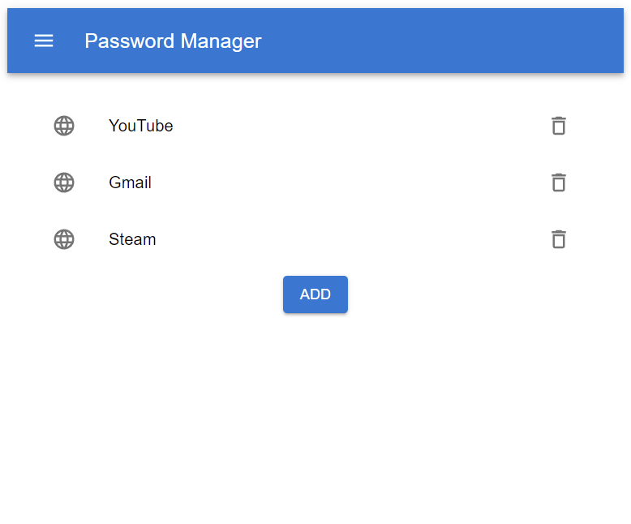

# MPC Password Manager

Prototype implementation for a password manager using MPC.

Built as part of a course project for [CS 227](https://cs127.boazbarak.org/).

**THIS SOFTWARE IS A PROTOTYPE ONLY -- USE AT YOUR OWN RISK**


## Installation
Before beginning, ensure you have the following:
* Python >= 3.8
* node >= 14
* npm >= 6.14

These instructions assume you are on a *nix system. Windows users may have to
adapt them to suit their particular environment.

Clone the repo
```sh
git clone https://github.com/wtong98/mpc_project.git
```

Create a virtual environment to host the Python dependencies
```sh
python -m venv venv_pm
source venv_pm/bin/activate   # or the correct activation script for your shell
```

Install the Python dependencies
```sh
cd mpc_project
pip install -r requirements.txt
```

Run the MPC server instances
```
python -m service
```

By default, 2 other server instances will be configured and initiated, acting
as two other parties in an MPC protocol. This command will execute until
terminated with `<CTRL> - C`.

In a separate window, activate the Python environment, navigate to the project
repo and start the password manager frontend
```sh
cd ui/build
python -m http.server
```

By default, this will start a simple HTTP server on port 8000. To view the
frontend, navigate to the following web-address in your browser: http://localhost:8000/

If all proceeded as expected, you should now be able to see the password manager!

<br />




